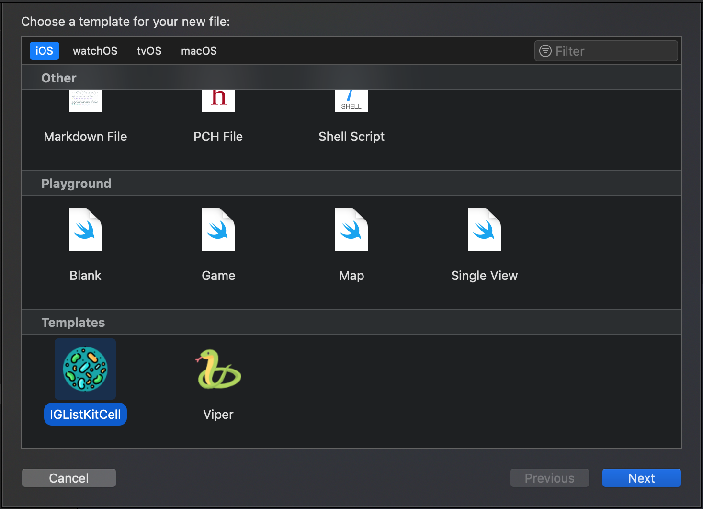
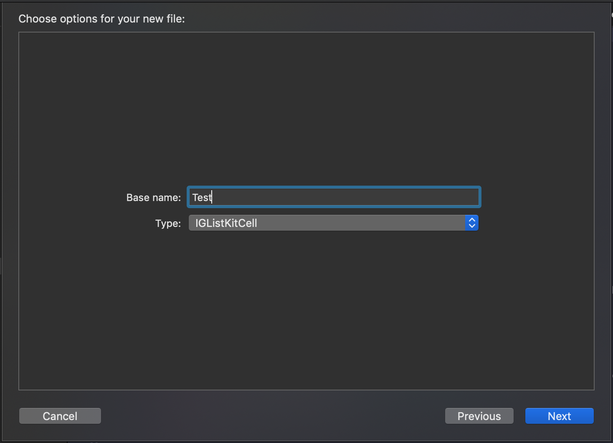

# IGListKitCell.xctemplate

## [Depreciado] ~> [Novos templates](https://github.com/victorpereiradepaula/VTemplates)

## Configuração

1. Tente acessar a seguinte pasta dos templates: ``` cd ~/Library/Developer/Xcode/Templates/ ``` 
    * Caso ela não exista crie: ``` mkdir ~/Library/Developer/Xcode/Templates/ ``` e execute novamente o passo **1.**
1. Clone o projeto ``` git clone git@github.com:victorpereiradepaula/IGListKitCell.xctemplate.git ```

## Uso

- Clique com o botão direito e selecione a opção **New File...**
- Procure em **Templates** o template com o nome desejado

<div style="text-align: center">
    
</div>

- Digite o nome base
    * Exemplo de base name: Title, que daria origem aos seguintes arquivos: TitleSectionController.swift, TitleSectionModel.swift, TitleCollectionViewCell.swift, TitleCollectionViewCell.xib

<div style="text-align: center">
    
</div>

### Referências:
- [Xcode 9 File Templates](http://jeanetienne.net/2017/09/10/xcode-templates.html)
- [Creating a reusable file template in xcode](https://medium.com/@abhimuralidharan/creating-a-reusable-file-template-in-xcode-8c49830bc3a0)
- [Cell icon](https://www.flaticon.com/free-icon/bacteria_1176251)
- [XcodeTemplates](https://github.com/vitormesquita/XcodeTemplates)
